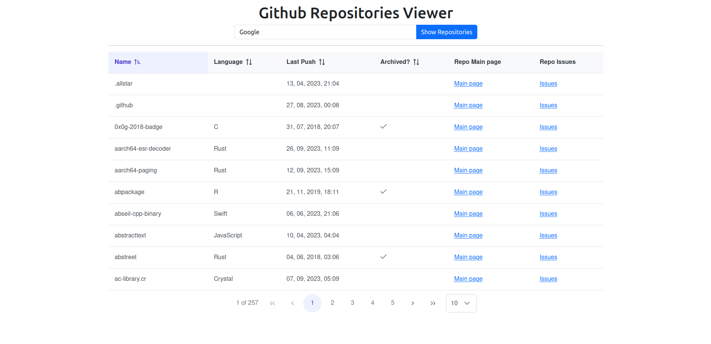

# Github-Repos-Viewer
A simple app to list organization's repos on Github.

[](https://github.com/AlexanderMac/github-repos-viewer/actions/workflows/ci.yml)



### Features
- A list of organization's public repos on Github
- Pagination
- Sorting
- A dialog with a list of top last 5 issues of the repo

### Set
- **Framework**: Angular v16
- **Language**: TypeScript v5
- **UI Lib**: PrimeNg v16
- **Build tool**: Webpack v5
- **CSS preprocessor**: SASS
- **CSS framework**: Bootstrap v5
- **Template engine**: Pug
- **Linters, Formatters**: ESLint, Prettier

### How to use
```sh
# Clone this repo:
git clone https://github.com/AlexanderMac/github-repos-viewer

# Init your repo:
cd github-repos-viewer && rm -rf .git && git init

# Install pnpm when needed:
npm install -g pnpm

# Install dependencies:
pnpm i

# Start app and watch for changes (dev server started on port 3000):
pnpm start
```

### Commands
```sh
pnpm generate   # angular generator
pnpm build      # build for dev
pnpm build:prod # build for production
pnpm start      # Start app and watch for changes (dev server started on port 3000)
pnpm lint       # run linter and fix found issues
pnpm format     # run prettier
```

### License
[MIT License](LICENSE)

### Author
Alexander Mac
